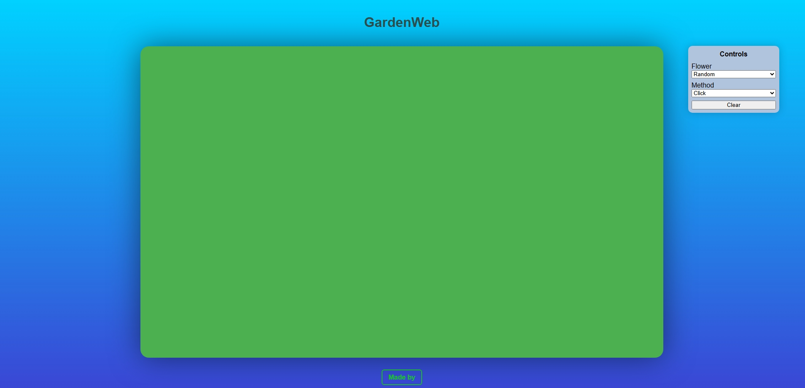

# 🌱 GardenWeb

GardenWeb is an interactive web project where you can create your own relaxing digital garden.  
Choose from a variety of flowers, decide how you want to plant them, and watch your garden come to life.

---

## ✨ Features
- 🌸 **Flower Selection** – Pick from multiple flowers or let it be random.  
- 🖱️ **Planting Methods** – Choose between *Click* or *Hover* to grow flowers.  
- 🧹 **Clear Option** – Reset the garden anytime and start fresh.  
- 🌿 **Relaxing Experience** – A peaceful and creative way to unwind on the web.  

---

## 🎮 How to Use
1. Open the project in your browser.  
2. Use the **Controls** panel to:
   - Select a flower type.  
   - Choose the planting method (*Click* or *Hover*).  
   - Clear the garden if you want to start over.  
3. Interact with the garden and enjoy growing your own digital oasis.  

---

## 🛠️ Technologies
- **HTML**  
- **CSS**  
- **JavaScript**  

---

## 📸 Preview

---

# ⏏️ Demo

🌐 [Live Demo](https://SEU-USUARIO.github.io/GardenWeb/)

